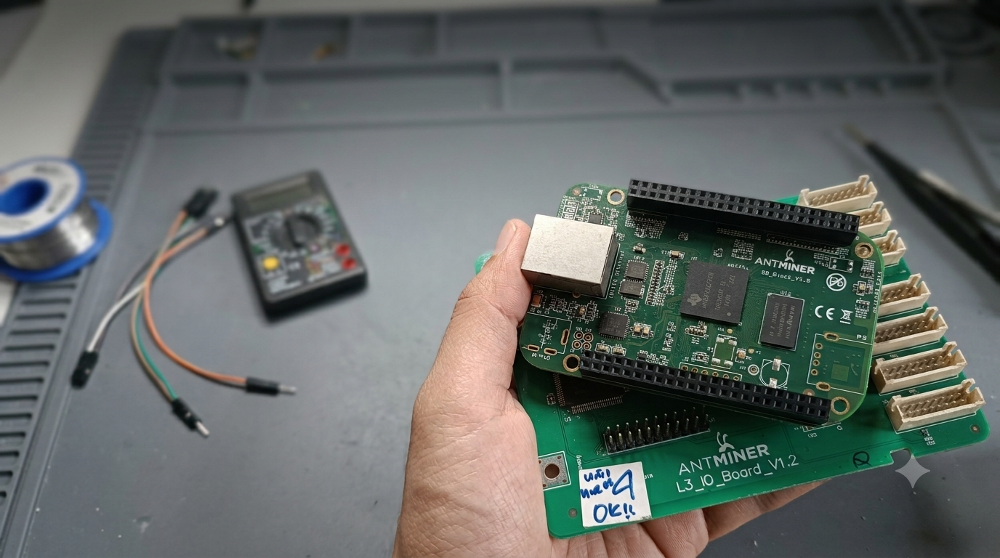

# AM335x StarterWare x CCS Portable Project

<p align="center">
  
</p>

> ⚠️ **Important — Use Case:** This project is **not** targeting the original BeagleBone. It is targeted at the **Antminer L3+** mining board, which is built around the **TI AM3352** (Cortex-A8) SoC. The PCB form factor is roughly similar to the BeagleBone Black, **but without the PRU subsystems**. This makes the Antminer L3+ a **low-cost option to repurpose** retired mining hardware as a learning platform for TI's bare-metal Cortex-A stack via StarterWare — "for fun and profit". The banner image above is the Antminer L3+ board itself.

<p align="center">
  <strong>A curated collection of standalone, portable StarterWare demo projects for the AM3352 (Antminer L3+) platform, ready to import into Code Composer Studio.</strong>
</p>

<p align="center">
  
  
  
  
  
</p>

---

## Overview

This repository hosts **independent, portable** Code Composer Studio (CCS) projects derived from TI's **AM335x StarterWare 02.00.01.01** package. Each project has been extracted out of the monolithic StarterWare tree and converted into a **self-contained CCS project** that lives entirely inside its own folder.

Unlike a "copied" StarterWare project — which usually drags in hundreds of `linkedResources` pointing back into the source tree (`.../AM335X_StarterWare_02_00_01_01/...`) — these projects carry **only the application source** for the demo. The StarterWare driver and system libraries are referenced through a single, centralized **library/include path** on disk:

```
C:\ti\AM335X_StarterWare_02_00_01_01
```

This makes the projects:

- **Portable** — move the workspace anywhere, only update the StarterWare root if needed.
- **Clean** — no `linkedResources` from inside the project folder pointing into the StarterWare tree.
- **Reproducible** — every project is a standalone CCS C project you can import in one click.

---

## Prerequisites

| Component | Version / Detail |
|---|---|
| Code Composer Studio | **[v12.8.1](https://www.ti.com/tool/download/CCSTUDIO/12.8.1)** — must include **Sitara AM3x ARM Processors** component |
| StarterWare Package | **version 02.00.01.01** — install **`AM335X_StarterWare_02_00_01_01`** at `C:\ti\` |
| Target Board | **Antminer L3+** (TI AM3352, Cortex-A8) — repurposed mining hardware |
| Emulator / Debugger | **J-Link** (tested & confirmed working) — solder a JTAG cable onto the Antminer L3+ board first. Follow the [BeagleBone Black JTAG connector soldering tutorial](https://dr-kino.github.io/2020/07/22/Beaglebone-black-soldering-jyag-connector/) (the JTAG footprint on the Antminer L3+ is in the same rear-edge position). XDS100v2 / XDS200 will also work if you prefer TI emulators. |

> The StarterWare driver libraries and include paths are pulled from:
> `C:\ti\AM335X_StarterWare_02_00_01_01`
>
> **Note on compatibility:** StarterWare 02.00.01.01 was originally written for the BeagleBone (AM335x). The Antminer L3+ uses the AM3352 — same ARM Cortex-A8 core, but **without the PRU** subsystems. Any demo that depends on PRU features will not work on this board. Stick to the GPIO / UART / Timer / MMCSD / RTC demos and you're good.

---

## Getting Started

Looking for the full step-by-step setup (download CCS, install StarterWare, import driver projects, build libraries, then import the portable samples)?

👉 **See [`INSTALL.md`](./INSTALL.md)** for the complete installation guide.

Quick summary:

1. Install **Code Composer Studio v12.8.1** into `C:\ti\ccs1281` with **Sitara AM3x ARM Processors** support.
2. Install **AM335x StarterWare 02.00.01.01** into `C:\ti\AM335X_StarterWare_02_00_01_01`.
3. In CCS, **Project → Import CCS Projects...** → point at the StarterWare root → tick **only `drivers`, `mmcsdlib`, `platform`, `system`, `utils`** → build all five (this produces the `.lib` files).
4. Delete those five projects from the Project Explorer **without** ticking "Delete project contents on disk" — the libraries stay on disk but disappear from the CCS view.
5. **Project → Import CCS Projects...** → point at the `Examples/` folder inside this workspace → tick the portable demos you want.
6. Build, launch a debug session, and run on the Antminer L3+.

---

## Project Index

> Each project below lives in its own folder under [`Examples/`](./Examples/). Click any title to jump to the folder. Descriptions are intentionally short — the per-project `README.md` inside each folder has the long version.
>
> **Project origin labels:**
> - 🟦 **StarterWare ref** — project that was imported directly from `C:\ti\AM335X_StarterWare_02_00_01_01\examples\` and adapted into a portable CCS project (still the StarterWare source as-is, only the project structure changed).
> - 🟧 **Custom from empty** — project built **from scratch** as an empty CCS project: hand-written `main.c`, hand-picked `cmd` linker script, but still references the StarterWare driver / system / platform / utils `.lib` files for the hardware drivers. These are the "what I would write myself" examples.

### Core / Boot

- 🟦 [**`Examples/boot/`**](./Examples/boot/) — Secondary bootloader: brings up clocks/PLLs/DDR, then loads the app from **MMC/SD (FAT)** or falls back to **XMODEM over UART**.
- 🟦 [**`Examples/demo/`**](./Examples/demo/) — Multi-driver showcase (GPIO + UART + timers). Good as a toolchain/target sanity check.

### GPIO

- 🟦 [**`Examples/gpioLEDBlink/`**](./Examples/gpioLEDBlink/) — Toggle a user LED at fixed intervals via GPIO1[23].
- 🟧 [**`Examples/AM3352_GPIO_LED/`**](./Examples/AM3352_GPIO_LED/) — Minimal GPIO1[23] blinky with a hand-rolled busy-wait delay.
- 🟧 [**`Examples/AM3352_GPIO_LED_DELAY/`**](./Examples/AM3352_GPIO_LED_DELAY/) — Same blinky, but the delay uses StarterWare's **IRQ-based `delay()` / `Sysdelay()`** via DMTimer7.
- 🟧 [**`Examples/AM3352_GPIO_LED_TIMER/`**](./Examples/AM3352_GPIO_LED_TIMER/) — Same blinky, but delay uses **polled DMTimer7** (no IRQ).
- 🟧 [**`Examples/AM3352_GPIO_LED_SEQUENCE/`**](./Examples/AM3352_GPIO_LED_SEQUENCE/) — **Running-light** animation across the 4 onboard LEDs.
- 🟧 [**`Examples/AM3352_GPIO_INTERRUPT/`**](./Examples/AM3352_GPIO_INTERRUPT/) — **GPIO input interrupt** on P9_12 (GPIO1[28] / global GPIO60), rising-edge trigger with debounce.

### Analog

- 🟧 [**`Examples/AM3352_ADC/`**](./Examples/AM3352_ADC/) — **ADC** AIN0 (P9_39) one-shot sampling. Prints `[AIN0] raw=NNNN mV=MMMM` every 500 ms over UART0.

### Timers

- 🟦 [**`Examples/dmtimerCounter/`**](./Examples/dmtimerCounter/) — DMTimer in free-running counter mode, tick value printed over UART. No IRQ overhead.
- 🟧 [**`Examples/AM3352_PWM_LED/`**](./Examples/AM3352_PWM_LED/) — **eHRPWM0A** output on P9_22 (GPMC_AD2, MUXMODE 6), ~39 kHz @ 50% duty. _🚧 WIP — pin not toggling yet._
- 🟦 [**`Examples/wdtReset/`**](./Examples/wdtReset/) — Enable the Watchdog and intentionally let it fire. Confirms WDT reset path works.

### Interrupt Handling

- 🟦 [**`Examples/irqPreemption/`**](./Examples/irqPreemption/) — Nested/pre-empting IRQs on the Cortex-A8 GIC.

### Performance / SIMD

- 🟦 [**`Examples/neonVFPBenchmark/`**](./Examples/neonVFPBenchmark/) — Cortex-A8 **NEON SIMD** + **VFPv3** benchmark.

### Communication

- 🟧 [**`Examples/AM3352_I2C_SCANNER/`**](./Examples/AM3352_I2C_SCANNER/) — **I2C1 bus scanner** on P9_17 (SCL) / P9_18 (SDA) @ 100 kHz.
- 🟧 [**`Examples/AM3352_I2C_SSD1306_LCD/`**](./Examples/AM3352_I2C_SSD1306_LCD/) — **SSD1306 OLED 128×32** display driver over I2C1.
- 🟦 [**`Examples/uartEcho/`**](./Examples/uartEcho/) — UART interrupt-driven echo. Pin-mux + FIFO + ISR skeleton for serial protocols.
- 🟦 [**`Examples/uartEcho_edma/`**](./Examples/uartEcho_edma/) — UART echo driven by **EDMA3** instead of the CPU.
- 🟦 [**`Examples/uartEdma_Cache/`**](./Examples/uartEdma_Cache/) — UART + EDMA + **L1/L2 cache coherency** (`CacheDataClean`/`Invalidate`).
- 🟦 [**`Examples/enetEcho/`**](./Examples/enetEcho/) — CPSW Ethernet L2 echo (loop frames in-and-out). Baseline for any L2 offload work.
- 🟦 [**`Examples/enetLwip/`**](./Examples/enetLwip/) — **LwIP TCP/IP** stack + embedded **HTTP server** on top of the EMAC driver.
- 🟧 [**`Examples/AM3352_SPI_TX/`**](./Examples/AM3352_SPI_TX/) — **SPI0 TX baseline** on P9_22 (CLK) / P9_18 (MOSI) / P9_17 (CS) @ 100 kHz.
- 🟧 [**`Examples/AM3352_SPI_ST7735/`**](./Examples/AM3352_SPI_ST7735/) — **ST7735 1.44" TFT LCD** (128×128 RGB565) driver over SPI0 @ ~4 MHz. Splash logo + counter/progress bar + color band demo.

### Memory & DMA

- 🟦 [**`Examples/edmaTest/`**](./Examples/edmaTest/) — **EDMA3** memory-to-memory copy.

### Storage

- 🟦 [**`Examples/hsMmcSdRw/`**](./Examples/hsMmcSdRw/) — MMC/SD block read/write via the MMCSD controller.

### Timekeeping

- 🟦 [**`Examples/rtcClock/`**](./Examples/rtcClock/) — Initialize the AM335x RTC, set time, read it back. _🚧 WIP — RTC time-set failing during port, under investigation._

---

## Project Status

| Project | Status | Notes |
|---|---|---|
| `boot` | ✅ Stable | — |
| `demo` | ✅ Stable | — |
| `gpioLEDBlink` | ✅ Stable | — |
| `AM3352_GPIO_LED` | ✅ Stable | — |
| `AM3352_GPIO_LED_DELAY` | ✅ Stable | — |
| `AM3352_GPIO_LED_TIMER` | ✅ Stable | — |
| `AM3352_GPIO_LED_SEQUENCE` | ✅ Stable | — |
| `AM3352_GPIO_INTERRUPT` | ✅ Stable | GPIO input interrupt on P9_12 + UART0 echo |
| `AM3352_I2C_SCANNER` | ✅ Stable | I2C1 bus scanner (P9_17/P9_18) @ 100 kHz |
| `AM3352_I2C_SSD1306_LCD` | ✅ Stable | SSD1306 OLED 128×32 driver over I2C1 (addr 0x3C) |
| `dmtimerCounter` | ✅ Stable | — |
| `wdtReset` | ✅ Stable | — |
| `irqPreemption` | ✅ Stable | — |
| `uartEcho` | ✅ Stable | — |
| `uartEcho_edma` | ✅ Stable | — |
| `uartEdma_Cache` | ✅ Stable | — |
| `enetEcho` | ✅ Stable | — |
| `enetLwip` | ✅ Stable | — |
| `edmaTest` | ✅ Stable | — |
| `neonVFPBenchmark` | ✅ Stable | — |
| `hsMmcSdRw` | ✅ Stable | — |
| `rtcClock` | 🚧 WIP | RTC time-set failing — porting in progress |
| `AM3352_ADC` | ✅ Stable | AIN0 (P9_39) one-shot @ 500 ms over UART0 |
| `AM3352_PWM_LED` | 🚧 WIP | eHRPWM0A on P9_22 not toggling |
| `AM3352_SPI_TX` | ✅ Stable | SPI0 continuous `0xAF` on P9_22/P9_18/P9_17 @ 100 kHz |
| `AM3352_SPI_ST7735` | ✅ Stable | ST7735 1.44" LCD demo via SPI0 @ ~4 MHz |

---

## How These Projects Are Different

A typical StarterWare "copied project" pulls source files via Eclipse `linkedResources` like this:

```xml
<link>
  <name>src/gpio.c</name>
  <locationURI>PARENT-2-Project_LOC/gpio.c</locationURI>
</link>
```

That means moving the project breaks it — the `PARENT-N-Project_LOC` chain only resolves correctly if the project sits at the exact same depth inside the StarterWare tree.

**This repository does it differently.** Each project folder contains:

- The demo's own `main.c` and application source
- The CCS `.project`, `.cproject`, `.ccsproject` and launch files
- Build output (`Debug/`, `Release/`)

The only external dependency is the **StarterWare library + include path**, which is a single environment-variable / project-variable pointer. Update one variable, and every project follows.

---

## Folder Layout

```
Workspace_12/
├── README.md                  ← you are here
├── INSTALL.md
├── .gitignore
├── Doc/
│   └── bg.png                 ← banner image
└── Examples/                  ← all portable CCS projects live here
    ├── AM3352_GPIO_LED/              ← minimal busy-wait blinky
    ├── AM3352_GPIO_LED_DELAY/        ← blinky + IRQ-based delay()
    ├── AM3352_GPIO_LED_SEQUENCE/     ← 4-LED running-light animation
    ├── AM3352_GPIO_INTERRUPT/        ← GPIO input interrupt (P9_12) + UART0 echo
    ├── AM3352_I2C_SCANNER/           ← I2C1 bus scanner (P9_17/P9_18)
    ├── AM3352_I2C_SSD1306_LCD/        ← SSD1306 OLED 128×32 driver (I2C1, addr 0x3C)
    ├── AM3352_GPIO_LED_TIMER/        ← blinky + polled DMTimer7 delay
    ├── AM3352_ADC/                   ← AIN0 (P9_39) one-shot @ 500 ms over UART0
    ├── AM3352_PWM_LED/               ← eHRPWM0A on P9_22 (🚧 WIP)
    ├── AM3352_SPI_TX/                ← SPI0 TX baseline (0xAF loop @ 100 kHz)
    ├── AM3352_SPI_ST7735/            ← ST7735 1.44" LCD driver (SPI0 @ ~4 MHz)
    ├── boot/                         ← secondary bootloader (SD/XMODEM)
    ├── demo/                         ← multi-driver showcase
    ├── dmtimerCounter/               ← DMTimer free-running counter
    ├── edmaTest/                     ← EDMA3 memory-to-memory copy
    ├── enetEcho/                     ← CPSW Ethernet L2 echo
    ├── enetLwip/                     ← LwIP TCP/IP + HTTP server
    ├── gpioLEDBlink/                 ← classic GPIO1[23] blinky
    ├── hsMmcSdRw/                    ← MMC/SD block read/write
    ├── irqPreemption/                ← nested-IRQ GIC test
    ├── neonVFPBenchmark/             ← NEON + VFPv3 benchmark
    ├── rtcClock/                     ← RTC demo (🚧 WIP)
    ├── uartEcho/                     ← UART interrupt echo
    ├── uartEcho_edma/                ← UART echo via EDMA3
    ├── uartEdma_Cache/               ← UART + EDMA + cache coherency
    └── wdtReset/                     ← watchdog reset demo
```

---

## License & Credits

These projects are derived from Texas Instruments' **AM335x StarterWare** package. Refer to the original StarterWare documentation for licensing details of the underlying driver libraries.

<p align="center"><sub>Built for the BeagleBone • Powered by StarterWare 02.00.01.01</sub></p>